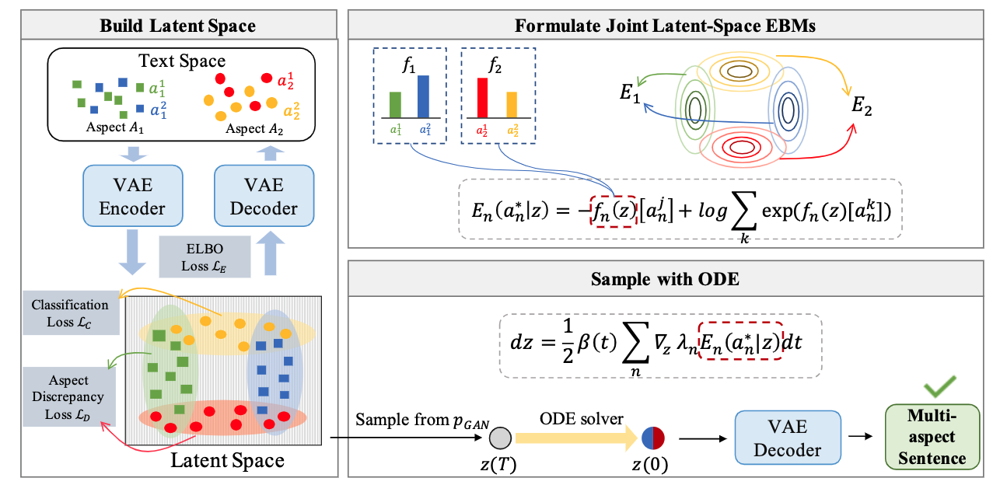

# MacLaSa

This is the official repo for our paper `MacLaSa: Multi-Aspect Controllable Text Generation via Efficient Sampling from Compact Latent Space`

## Model Overview
<p align="center"></p>

An overview of MacLaSa. **Left**: Build latent space for MacLaSa. We utilize the VAE framework with two additional losses to build a compact latent space. **Top Right**: Formulate joint EBMs. We formulate the latent-space EBMs of latent representation and attribute to facilitate the plug in of multiple attribute constraint classifiers. **Bottom Right** Sample with ODE. We adopt a fast ODE-based sampler to perform efficient sampling from the EBMs, and feed samples to the VAE decoder to output desired multi-aspect sentences.

## Dataset and CheckPoint
1. Download our training data from this [link](https://drive.google.com/file/d/1Ff4yKtC4HQHeGXMZgOR3ILNzGcIS5D6w/view?usp=sharing). Unzip them and put them under the `data` directory.

2. Download the discriminator checkpoints ([Sentiment Discriminator](https://drive.google.com/file/d/1PqDYwCt6HhDcjoM_Yiq84Ny97yiiLBUa/view?usp=sharing), [Topic Discriminator](https://drive.google.com/file/d/1vyopXXKhelkZKAp_Ivb7KdtyhLXaZxrG/view?usp=sharing)) used to evaluate multi-aspect control. Unzip them and put them under the `model` folder.

## Quick Start

1. Training of VAE. It is used to build compact latent space
```bash
python main.py --checkpoint_dir ./model \
--train_senti_data_file ./data/imdb/train.csv \
--train_topic_data_file ./data/agnews/train.csv \
--eval_senti_data_file ./data/imdb/test.csv \
--eval_topic_data_file ./data/agnews/test.csv \
--latent_loss_weight 1.0 \
--gap_loss_weight 1.0 \
--learning_rate 1e-4 \
--num_train_epochs 50
```

2. Training of GAN. It is used to simulate prior distribution p(z)
```bash
python train_classifier.py --train_cls_gan gan \
--train_senti_data_file ./data/imdb/train1w.csv \
--train_topic_data_file ./data/agnews/train1w.csv \
--eval_senti_data_file ./data/imdb/test1k.csv \
--eval_topic_data_file ./data/agnews/test1k.csv \
--checkpoint_dir ./model/CKPT_NAME \
--output_dir ./model/CKPT_NAME \
--learning_rate 1e-5 \
--num_train_epochs 5
```

3. Training of attribute classifiers. They are used to guide complex multi-aspect control

(1) for sentiment classifier
```bash
python train_classifier.py --train_cls_gan cls \
--save_step 1 \
--n_classes 2 \
--train_senti_data_file ./data/imdb/train1w.csv \
--eval_senti_data_file ./data/imdb/test1k.csv \
--checkpoint_dir ./model/CKPT_NAME \
--output_dir ./model/CKPT_NAME \
--learning_rate 1e-5
```

(2) for topic classifier
```bash
python train_classifier.py --train_cls_gan cls \
--save_step 2 \
--n_classes 4 \
--train_topic_data_file ./data/agnews/train1w.csv \
--eval_topic_data_file ./data/agnews/test1k.csv \
--checkpoint_dir ./model/CKPT_NAME \
--output_dir ./model/CKPT_NAME \
--learning_rate 1e-4
```

4. Generation. Conduct conditional generation to obtain desired multi-apsect senteces.
```bash
python generate.py --checkpoint_dir ./model/CKPT_NAME --output_dir ./outputs/
```

5. Evaluation. After generation, perform automatic evaluation to assess the quality of generated texts.
```bash
python evaluate.py --output_save_dir ./outputs/OUTPUT_NAME/ \
--sentiment_discriminator_save_dir ./model/ \
--topic_discriminator_save_dir ./model/
```

## Reference
If you find the code helpful, please cite our paper:
```
@article{ding2023maclasa,
  title={MacLaSa: Multi-Aspect Controllable Text Generation via Efficient Sampling from Compact Latent Space},
  author={Ding, Hanxing and Pang, Liang and Wei, Zihao and Shen, Huawei and Cheng, Xueqi and Chua, Tat-Seng},
  journal={arXiv preprint arXiv:2305.12785},
  year={2023}
}
```
